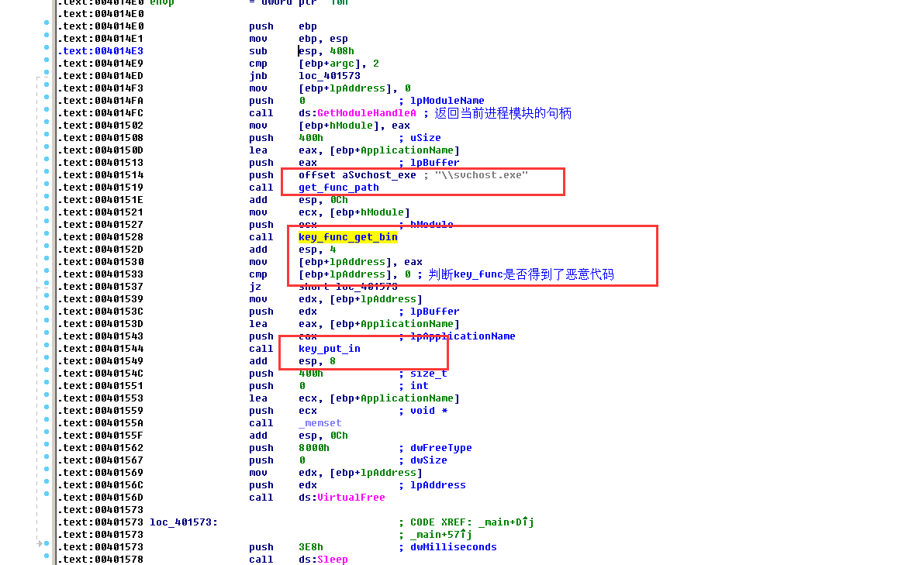
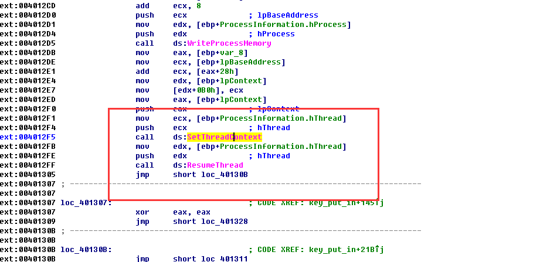

# 进程替换

### 效果

可以拥有被替换进程相同的权限。

### 手法

进程替换的关键是以挂起状态创建一个进程，这意味着这个进程会被载入内存，但是它的主线程被挂起，在外部的程序恢复主线程之前，这个程序不做任何事情。

PS：CreateProcess 的dwCreationFlags参数为CREATE_SUSPENDED(0x4)，来得到这个进程的挂起状态。

其通过找到目标程序，然后读取存储在自己资源节中的恶意程序到内存当中，然后通过CreateProcess来使得进程处于挂起状态，然后通过读取PEB(进程环境块)来使得我们可以操作这个新建进程，然后我们可以在他的进程空间内解析函数，然后把资源节中的代码copy过去

关键在于SetThreadContext 这个API为创建的进程重新设置入口点，然后利用ResumeThread函数启动线程，那么我们就实现了进程替换。

Main函数示例：

恶意代码读入到合适的位置之后：

### 特点

一般注入器的.src段 ， 资源节里面会添加大量的恶意程序信息，不过很可能被加密过了。

### 关键API

SetThreadContext  

ResumeThread